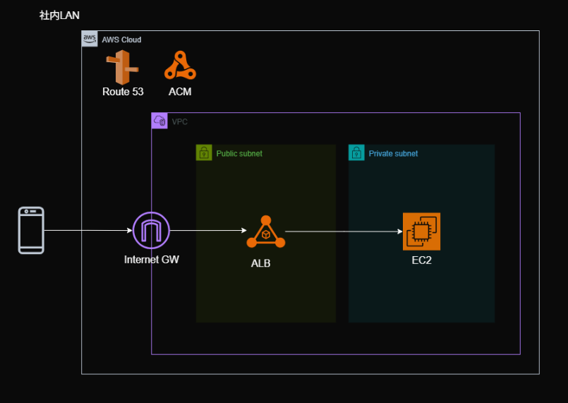

# 概要

パスワード管理ツール Bitwarden のセルフホストを AWS 上で行う。  
インフラ構築は Terraform、IAC CI/CD ツールに Atlantis を使用。

構成図  

## 技術的な挑戦と学び

### IaC（Infrastructure as Code）の導入
- Terraform を本格的に利用し、VPC、サブネット、EC2、ALB、セキュリティグループ等の AWS リソースをコードで定義する手法を学んだ。
- GUI での手動設定では見落としがちな通信経路やセキュリティ設定を、コードとして可視化・管理する重要性を体感した。
- Pull Request で Terraform のエラーをチームメンバーと共有し、レビューを通じて解決策を探すプロセスは個人開発との大きなギャップがあった。プルリクの説明を丁寧に書く必要があると学んだ。

### リアルなセキュリティの理解
- 「既存ネットワークだけでいいのでは？」という疑問から、単に通信を許可するだけでなく、HTTPS 通信の仕組みや証明書発行プロセスを理解することが堅牢なセキュリティ構築に不可欠であると学んだ。
- 既存ネットワークよりセキュアな構築ができるセルフホストは機密情報管理に必要だと感じた（例：家庭 LAN のみを通す仕組みを作りたい）。
- AWS 上でサービスを公開する際のセキュリティリスクとその回避方法について、より現実的な視点を得られた。

## チーム開発とコミュニケーションの重要性

### 個人開発とのギャップ
- 個人開発ではあまり発生しない、メンバー間での頻繁な相談や朝会・夕会での進捗報告を経験し、チーム全体での共通認識の重要性を学んだ。
- Pull Request に詳細な説明を記載することで、レビュー担当者に意図や変更内容を正確に伝えることの重要性を再認識した。
- 会議での相談は大事。

## まとめ
今回のインターンシップを通して、インフラ構築に対する考え方が大きく変わった。以前は「サービスの安定稼働を支える泥臭い仕事」というイメージだったが、今ではアプリケーション全体の基盤を設計し、最新技術とセキュリティを考慮したアーキテクチャを構築する、非常にクリエイティブでやりがいのある仕事だと感じている。

この経験は、将来的にフルスタックエンジニアとしてアプリケーション開発だけでなく、その基盤となるインフラまで見通せる技術者を目指す上での大きな一歩となった。

## 今やっていること
- 早期専攻
- 就業型インターンに参加

### 反省
- フィードバック時に頂いたメッセージが響いた。
- Terraform での環境構築の基礎を教えてほしかったが、自分で調べる大切さも痛感した。
- 就活でコーディングテストが苦手。コーディングテストがない大企業はあるか検討中。

## フィードバック面談

### よかったところ
- スピード感を持って対応できた。
- まず動こうという姿勢。
- 問いかけに対して素早くリアクションがあった。
- わからないことをすぐに聞く姿勢（コミュニケーション能力が高い）。

### 直したほうが良いところ
- 教えている最中に手を動かし始める（見切り発車気味）。
- 落ち着いて相手の話に耳を傾けると良い。

